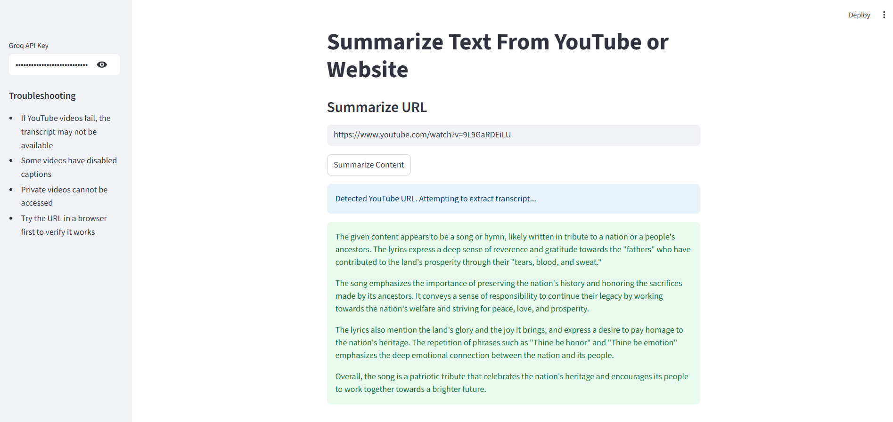
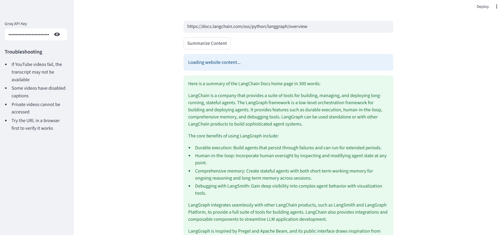

<div align="center">
  <strong></strong>

  # YouTube & Website Summarizer

  _By **BINATI AInalytics**_
</div>


A Streamlit web application that uses LangChain and Groq AI to automatically summarize content from YouTube videos and websites. Get concise 300-word summaries of any video or article with just a URL!

See deployed demo at https://youtube-website-summarizer-wfvyhqux3bwj2ss5gqsqgm.streamlit.app/ 

# Demo





## Features

- **YouTube Video Summarization**: Extracts transcripts from YouTube videos and generates summaries
- **Website Content Summarization**: Processes text content from any website
- **Multiple Extraction Methods**: Uses robust fallback methods to handle YouTube's anti-bot measures
- **AI-Powered**: Leverages Groq's fast LLM API for intelligent summarization
- **User-Friendly Interface**: Clean Streamlit interface with real-time status updates

## Quick Start

### Prerequisites

- Python 3.8 or higher
- Groq API key (free at [groq.com](https://groq.com))

### Installation

1. **Clone the repository**
   ```bash
   git clone https://github.com/CyprianFusi/youtube-website-summarizer.git
   cd youtube-website-summarizer
   ```

2. **Install dependencies**
   ```bash
   pip install -r requirements.txt
   ```

3. **Run the application**
   ```bash
   streamlit run app.py
   ```

4. **Open in browser**
   - The app will automatically open at `http://localhost:8501`
   - Enter your Groq API key in the sidebar
   - Paste any YouTube or website URL to get started!


## Usage

### Getting a Groq API Key

1. Visit [groq.com](https://groq.com)
2. Sign up for a free account
3. Navigate to the API section
4. Generate your API key
5. Copy and paste it into the app's sidebar

### Supported URLs

**YouTube Videos:**
- `https://www.youtube.com/watch?v=VIDEO_ID`
- `https://youtu.be/VIDEO_ID`
- `https://www.youtube.com/embed/VIDEO_ID`

**Websites:**
- Any publicly accessible website URL
- News articles, blog posts, documentation, etc.

### Example Usage

1. **YouTube Video**: Paste `https://www.youtube.com/watch?v=dQw4w9WgXcQ`
2. **Website**: Paste `https://en.wikipedia.org/wiki/Artificial_intelligence`
3. Click "Summarize Content"
4. Get a concise 300-word summary!

## How It Works

### Architecture


### Key Components

- **Content Extraction**: Multiple methods ensure reliable content retrieval
- **LangChain Integration**: Seamless document processing and chain management
- **Groq AI**: Fast, efficient language model for summarization
- **Error Handling**: Comprehensive fallback mechanisms for robust operation

## Configuration

### Environment Variables (Optional)

Create a `.env` file for default settings:

```env
GROQ_API_KEY=your_groq_api_key_here
DEFAULT_SUMMARY_LENGTH=300
```

### Customization

**Change Summary Length**: Modify the prompt template in `app.py`:

```python
prompt_template = """
Provide a summary of the following content in 500 words:  
Content:{text}
"""
```

**Different LLM Model**: Change the model in the ChatGroq initialization:

```python
llm = ChatGroq(model="llama-3.1-70b-versatile", groq_api_key=groq_api_key)  # Larger model
```

## Troubleshooting

### Common Issues

**YouTube Videos Not Loading**
- Some videos may have disabled captions/transcripts
- Private videos cannot be accessed
- Age-restricted content may fail
- Try the URL in a browser first to verify accessibility

**Website Loading Errors**
- Some sites block automated scraping
- SSL certificate issues (app tries both secure and insecure connections)
- Rate limiting by the target website

**API Errors**
- Verify your Groq API key is correct and active
- Check your API usage limits
- Ensure stable internet connection

### Error Messages

| Error | Solution |
|-------|----------|
| "Bad Request" | Usually YouTube access issue - try a different video |
| "No content found" | The URL may not have extractable text content |
| "Invalid URL" | Check the URL format and ensure it's accessible |
| "API Key Error" | Verify your Groq API key in the sidebar |

## Contributing

We welcome contributions! Here's how to get started:

1. **Fork the repository**
2. **Create a feature branch**
   ```bash
   git checkout -b feature/amazing-feature
   ```
3. **Make your changes**
4. **Add tests** (if applicable)
5. **Commit your changes**
   ```bash
   git commit -m 'Add amazing feature'
   ```
6. **Push to the branch**
   ```bash
   git push origin feature/amazing-feature
   ```
7. **Open a Pull Request**

### Development Setup

```bash
# Install development dependencies
pip install -r requirements.txt

# Run tests
python -m pytest tests/

# Format code
black app.py
```

## Roadmap

- [ ] **Batch Processing**: Summarize multiple URLs at once
- [ ] **Export Options**: PDF, Word, and markdown export
- [ ] **Language Support**: Multi-language transcript extraction
- [ ] **Custom Prompts**: User-defined summarization templates
- [ ] **History**: Save and manage previous summaries
- [ ] **API Endpoint**: REST API for programmatic access
- [ ] **Chrome Extension**: Browser extension for one-click summarization

## License

This project is licensed under the MIT License - see the [LICENSE](LICENSE) file for details.

## Acknowledgments

- [LangChain](https://langchain.com) for the excellent framework
- [Groq](https://groq.com) for fast AI inference
- [Streamlit](https://streamlit.io) for the beautiful web interface
- [yt-dlp](https://github.com/yt-dlp/yt-dlp) for reliable YouTube access
- [YouTube Transcript API](https://github.com/jdepoix/youtube-transcript-api) for transcript extraction

## Support

- **Issues**: [GitHub Issues](https://github.com/yourusername/youtube-website-summarizer/issues)
- **Discussions**: [GitHub Discussions](https://github.com/yourusername/youtube-website-summarizer/discussions)
- **Email**: your.email@example.com

---

**⭐ If this project helped you, please give it a star on GitHub!**
